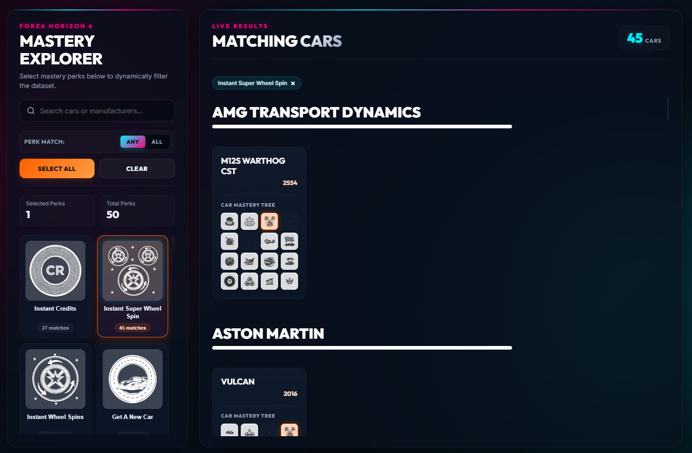

# Forza Horizon 6 Mastery Explorer

A web-based interactive tool created to provide a comprehensive, high-fidelity overview of the mastery trees for cars in Forza Horizon 6.



> [!IMPORTANT]
> This project is a **living document**. The dataset and mastery details will be continuously updated as soon as the mastery tree of each car can be verified in-game.

## Features

- **Interactive Selection Panel**: Click on various mastery perks (e.g., instant credits, wheel spins, skill boosts, event-specific multipliers) to filter the list of cars that contain them.
- **Dynamic Matching Logic**: Filter cars using `ANY` or `ALL` logic gates.
- **Searchable Database**: Quickly search for specific cars or manufacturers using the real-time search bar.
- **Manufacturer Grouping**: Matches are neatly grouped by manufacturer under prominent headings with custom dividers.
- **Visual Mastery Trees**: Every car displays its full 4x4 mastery tree layout, with active filters highlighted dynamically.
- **SVG Icon Backdrops**: Specially customized backdrops ensure that transparent mastery vector icons are clearly visible.

The project automatically deployes the latest version to github pages so that you can use it straight away. https://mommel.github.io/Forza-Horizon-6-Mastery-Explorer/
I update the cars data by taking a screenshot and running automated processes over the screenshot to extract the mastery data. Sometimmes there might be a typo in a cars name, just create an issue so that i will update the name in the process that updates the mastery data json.

## Project Structure

- `src/`: Source files containing development code
  - `index.html`: The HTML shell and template layouts.
  - `app.js`: Application state management, data loading, sorting, and dynamic rendering.
  - `styles.css`: Glassmorphic styling system, responsive grid layouts, and visual animations.
  - `mastery_all.json`: The database containing verified car mastery specifications.
- `assets/`: Vector SVGs of the mastery perks and icons.
- `build_single_file.py`: A Python compiler script that bundles all assets, styles, and logic from `src/` into a single standalone `index.html` file at the root.
- `index.html` (root): The compiled standalone distribution build of the web app.
- `.github/workflows/deploy.yml`: GitHub Actions workflow to deploy the project to [GitHub Pages](https://mommel.github.io/Forza-Horizon-6-Mastery-Explorer/).


## Running Locally

No need for a local server. Just open the 'index.html' from project root in your web browser.

## Building/Compiling

All files are developed in `src/` folder. By running the python script everything will be bundled into a single 'index.html' file in the root. Benefit it runs diectly as is.

```
python build_single_file.py
```

## Disclaimer

Forza Horizon 6 is a registered trademark and property of Microsoft Corporation and Playground Games. This project is a non-commercial, fan-made tool created solely for the community to explore car mastery trees. It is not affiliated with, authorized, endorsed, or in any way officially connected to Playground Games, Microsoft Corporation, or the Forza Horizon franchise.

